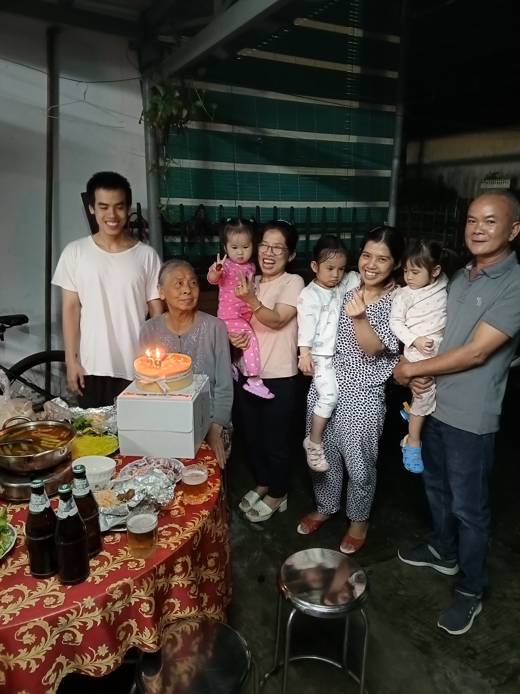

This morning, my parents went to a grand opening celebration at in Mom's village

I had planned to go with them, but the car did not have enough seats because some of Mom's relatives also asked to ride

It turns out a new law only allows seven people, including the driver, in a seven-seat car

So I had to ask Aunt Gai for some rice this afternoon

She also gave me some fried rolls

Tonight, I had my birthday party with all of my family

It was so memorable

After the party, Aunt Thuy gave 10 million to each family and 2 million to each of her nieces and nephews, including me

