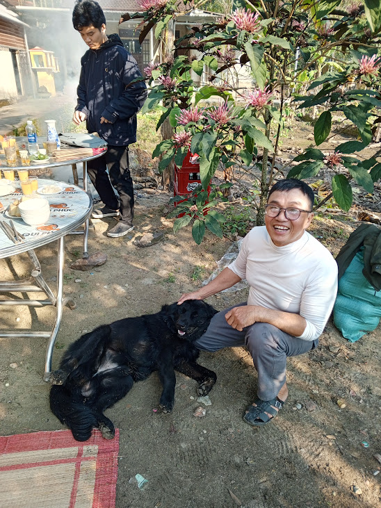

This morning, Grandma and I had vegetarian breakfast with Aunt Gai and her mother

Afterward, I drove Grandma to the construction site of Aunt Roi's house

On the way, we saw a big black dog

At the site, Aunt Roi's family was already there

The black ran to Uncle Dung and lay down next to him

He even petted the dog

The dog looked so adorable, so I petted him too

It then saw Chien and sniffed him, but Chien didn't like it

Chien pushed the black dog away

However, the black dog was still friendly

He wasn't scared and continued letting me pet him

When I stopped, he even followed and begged me for more
