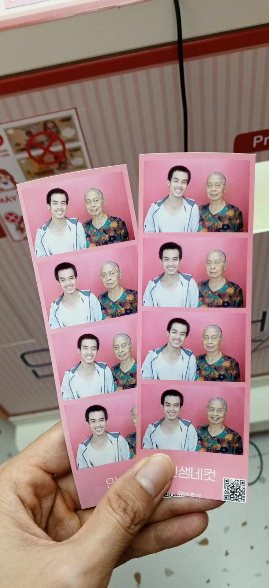

This afternoon, when I woke up, Chien was barking at someone outside of my house

I told him to be quiet, but he didn't listen

I went to the door to see who it was

Two children, who often play with Chien, were playing in front of my house

They greeted and asked me about him

I called Chien over and let him play with them

They had a small white puppy with them

Later, Grandma and I went to AEON Mall

It was very crowded

I took Grandma to a coffee shop, but the line was so long, so we gave up and walked around the mall instead

We went to the third floor and stopped at a message chair

I let Grandma try it and then explored the floor

We then visited a Korean photo booth, but I had to exchange money at the cashier to use the booth

We left the photo booth and went to the first floor

Grandma was tired, so I found her a chair to sit down

She held my right arm

My left hand the loose pant slipping down slowly

I left her at the chair and went to the rest room to fix the pant

After that, I went to the supermarket and bought blueberry jam and butter

We then went to Aunt Roi's house

