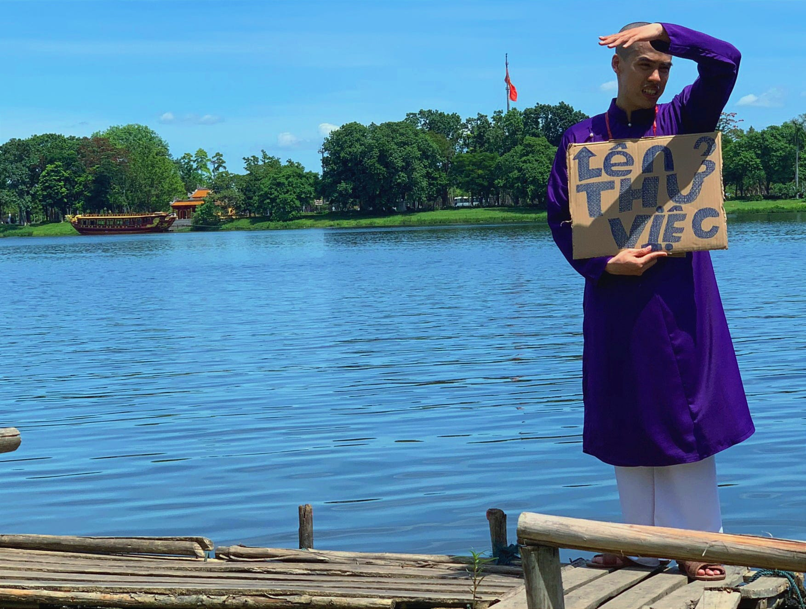
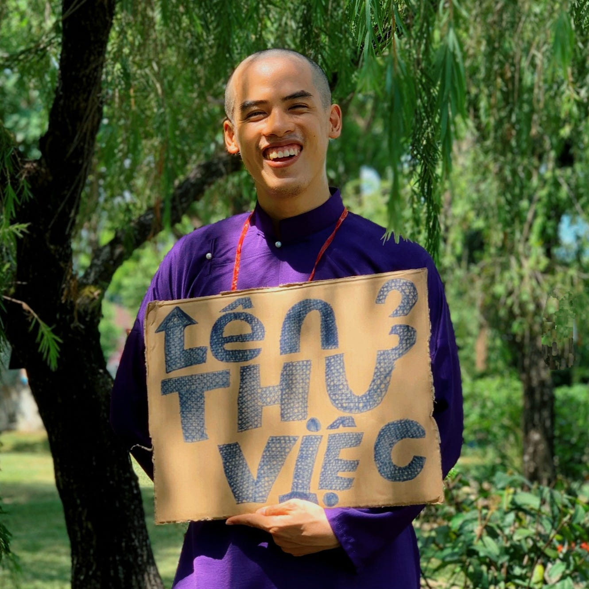
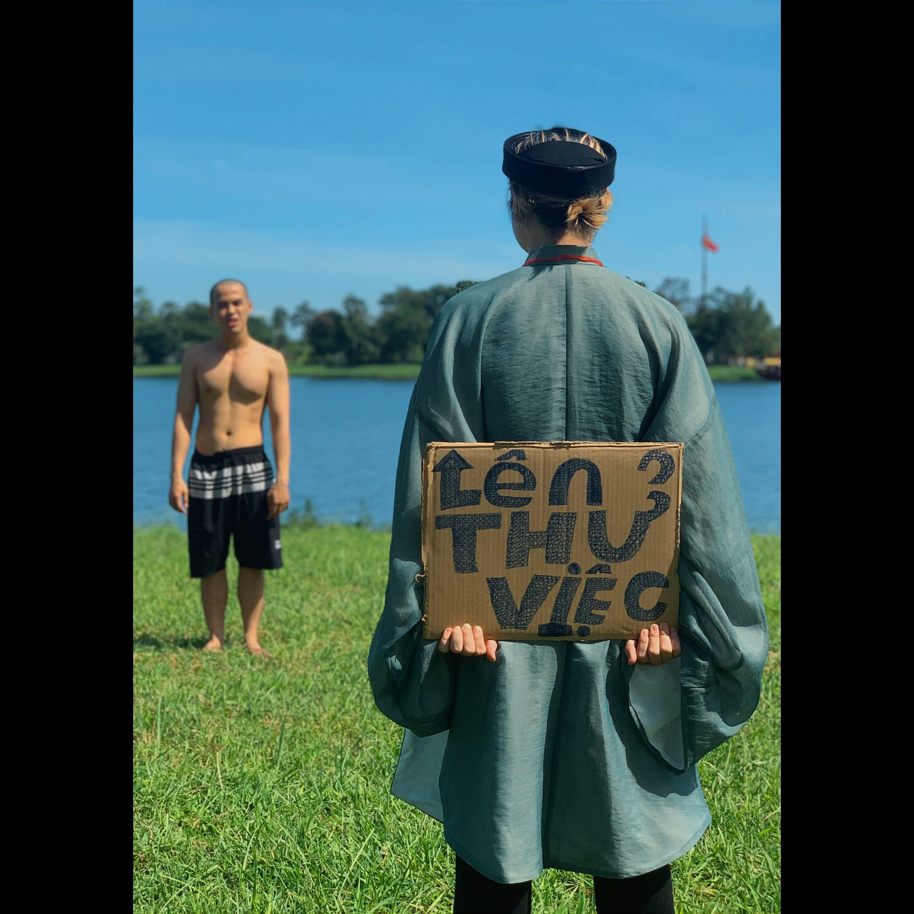
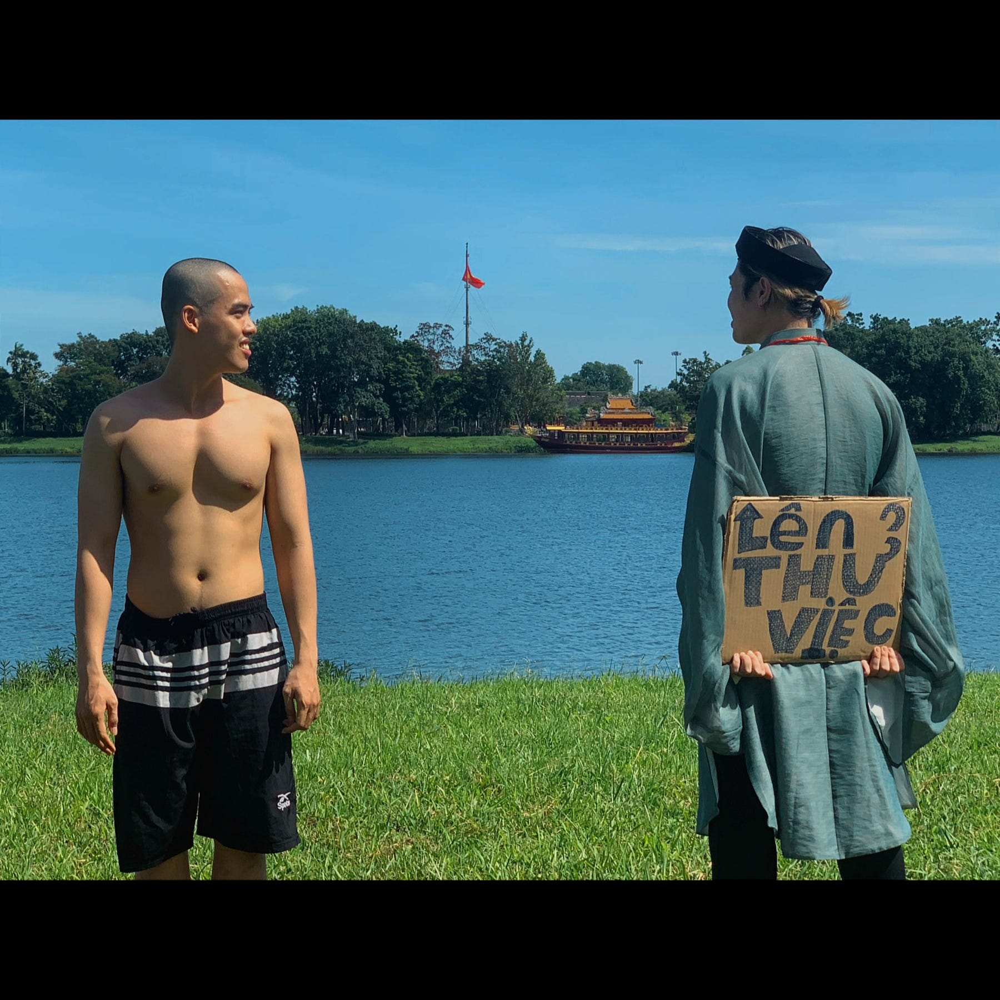
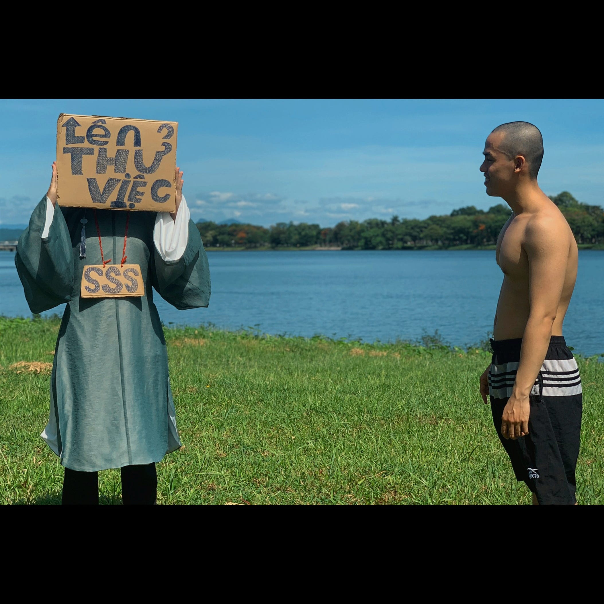
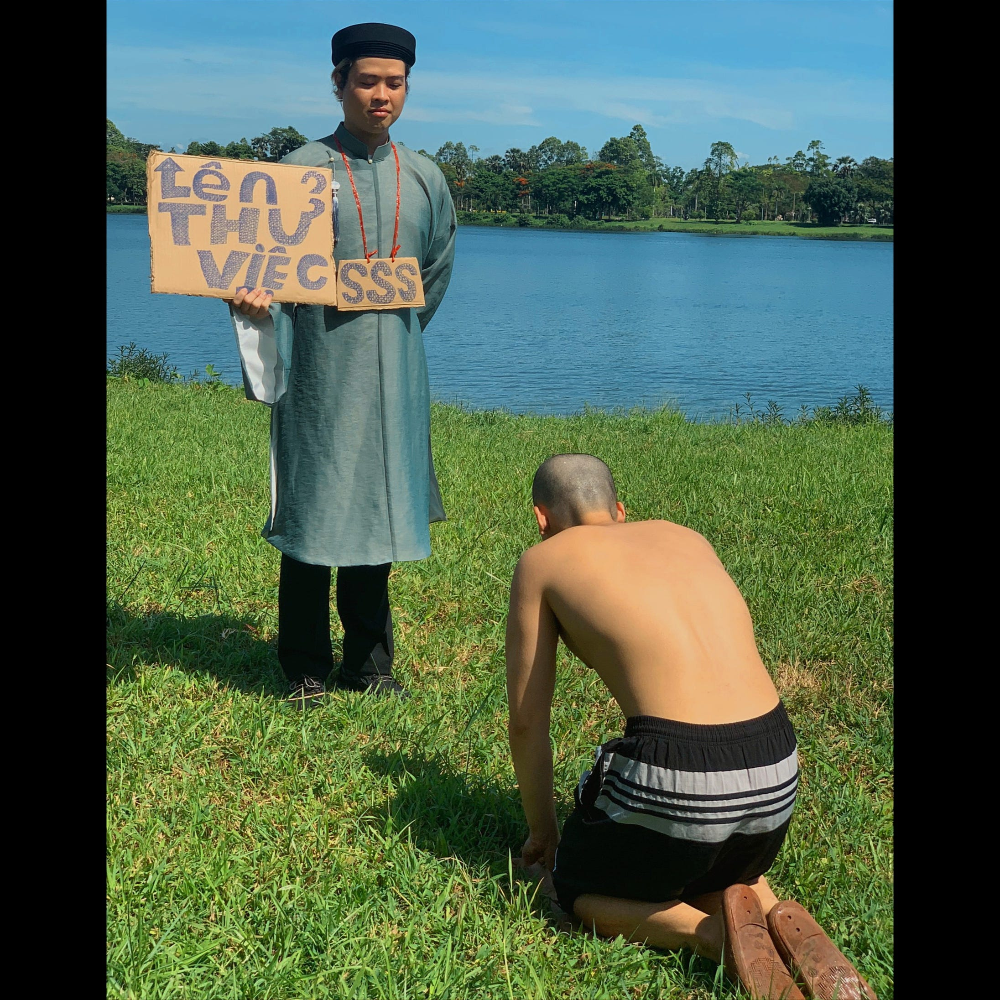
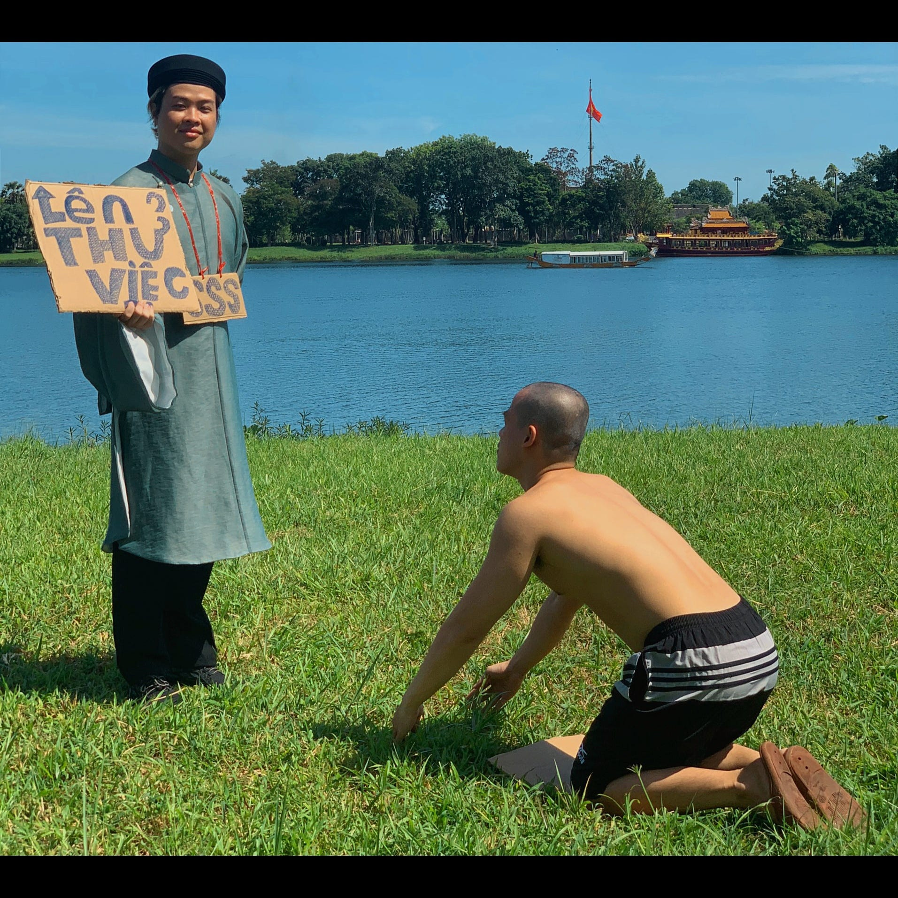
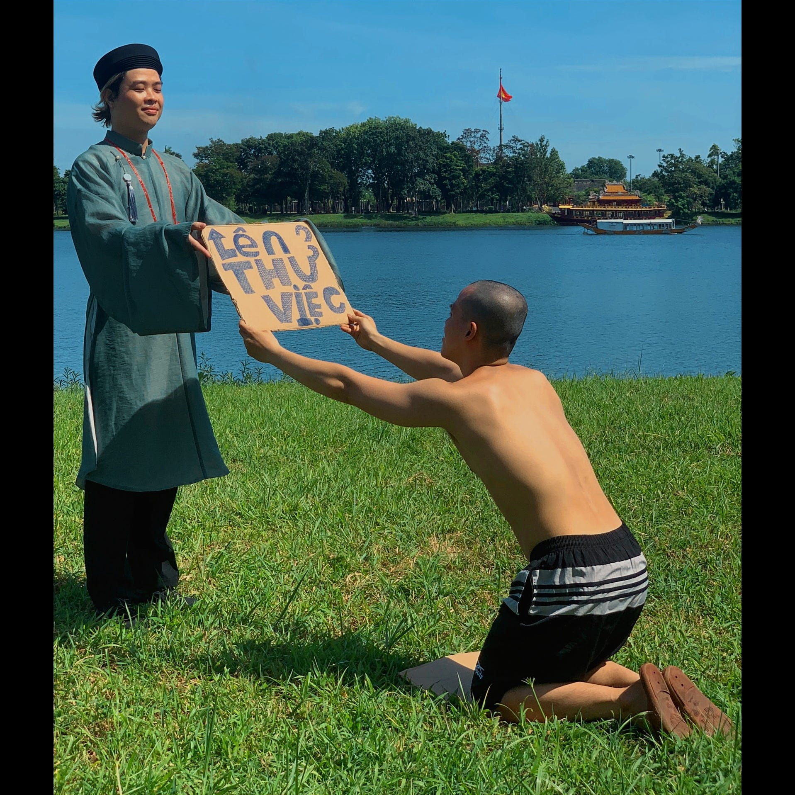
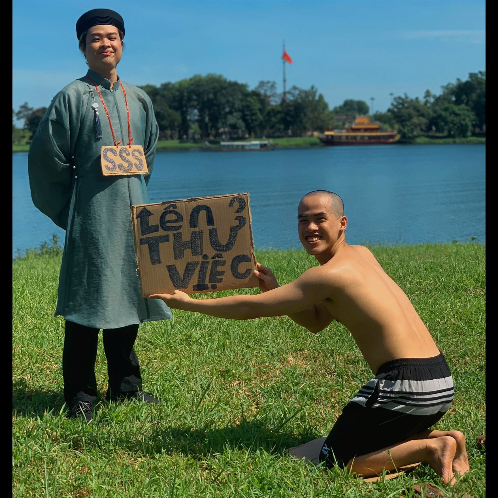
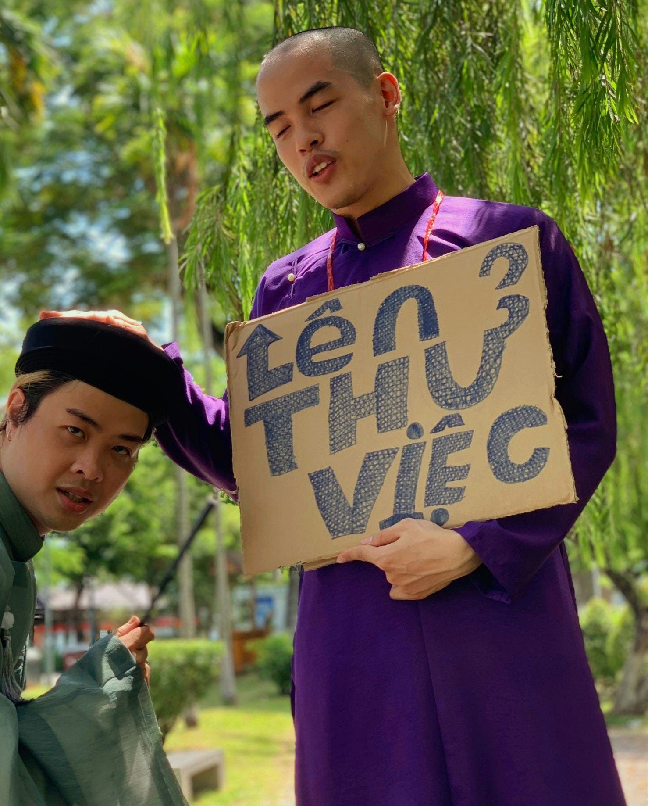

Ngày mà mình chờ đợi mòn mỏi suốt bốn tháng qua cuối cùng cũng tới.
Mình đã thoát được kiếp học việc và lên thử việc.

Để chuẩn bị cho ngày hôm nay, mình đã rủ anh bạn học việc cùng đi chụp ảnh kỷ niệm.

Lúc đầu mình định thuê một bộ cổ phục màu hồng, qua Đại Nội chụp một tấm, rồi về đưa cho hr để gửi welcome email. Mình đã suy nghĩ về tạo hình, định sẽ bắt chước Tinh Hà Xán Lạn, và cũng làm quạt mo để ra vẻ thư sinh.

Nhưng nghĩ đi nghĩ lại, đây là lần thứ hai và có thể sẽ là lần cuối mình đi từ học việc lên, nên mình muốn chơi lớn, làm nguyên một album để kể chuyện. Câu chuyện của mình là về một chàng trai nghèo hèn chẳng có gì ngoài cái quần và đôi dép, được một ông tiên ban cho tấm bùa vàng có phép màu. Từ lúc cậu nhận tấm bùa, đời cậu bước sang trang mới.

Để chuẩn bị cho bộ ảnh, mình đã đi tìm chỗ chụp. Mình thích cảnh thiên nhiên, nên mỗi lần dắt con Chien đi bộ ở hai bên bờ sông Hương, mình đều để ý coi có chỗ nào đẹp. Cuối cùng lựa được bãi cỏ sau lưng bia Quốc Học.

Về phần đạo cụ, mình nhờ mẹ xin o bán tạp hóa bên cạnh mẹ một thùng carton, rồi về cắt ra làm tấm “Lên thử việc” với tấm “SSS”.

Mình cũng giảm cân cho ra dáng nghèo hèn nhưng không kịp.

Mình giấu ý tưởng chụp ảnh theo câu chuyện với anh bạn mình vì sợ anh không chịu. Tới ngày chụp, mình vẫn đi thuê đồ như thường. Mình thuê áo dài màu tím vì thích bộ đồ mấy ông công công mặc trong Thiếu Niên Ca Hành. Mình hẹn anh bạn ra bia Quốc Học. Anh đi với vợ để chị vợ chụp cho tụi mình.

Lúc đầu mình vẫn chụp vài bức mặc áo dài với anh bạn. Sau đó mình cởi áo dài với quần trắng rồi lấy đạo cụ ra. Anh bạn lỡ phóng lao rồi nên phải theo thôi.

Bước cuối cùng là chỉnh sửa ảnh. Mình lên Youtube học cấp tốc cách sắp xếp bố cục ảnh và chỉnh màu. Trong lúc chỉnh ảnh, mình muốn tone màu của ảnh giống màu trong Thiếu Niên Ca Hành, nhưng mình dùng phần mềm mặc định của điện thoại nên làm không được. Cuối cùng mình dùng filter màu xanh biển đậm của máy.

Ngày qua mình đã gửi cho hr bức đứng che nắng ở bờ sông, nhưng hôm nay, trong email lại là mặt mình trong bức này

Thôi thì như vậy cũng được rồi. Coi như công sức mình chuẩn bị cũng xứng đáng.
