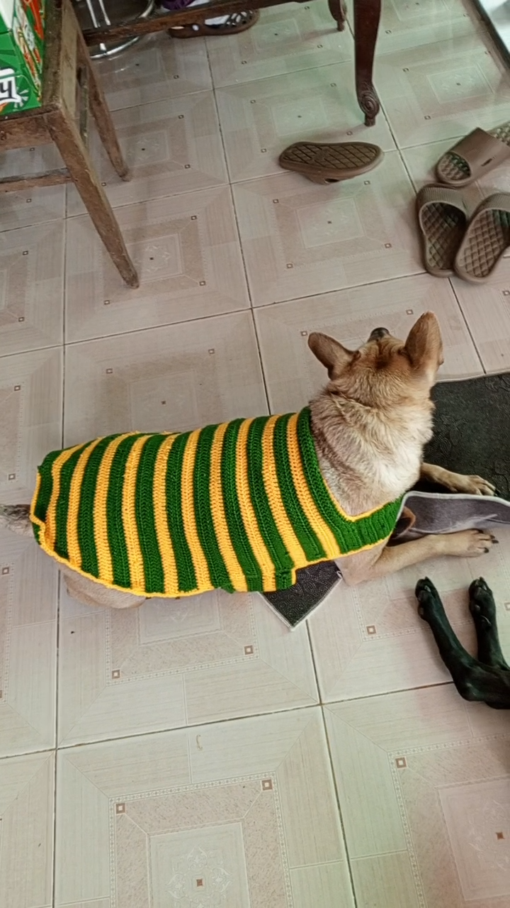

This morning, I took my motorbike to Uncle No's house to wash it, then walked Ben home and finished crocheting "Đong Đầy"

Then I took Ben home and tried the sweaters on him and Chien

They looked great

However, when I wasn't looking, Ben ran away even though I called him back

I took Chien around my neighborhood to look for Ben, but we couldn't find him

I went home and borrowed Uncle Chinh's bicycle

I rode the bike to the area near Aunt Thuy's house and saw Ben running

I rode as fast as I can and called him

Luckily, Ben still heared me and ran toward me, so I walked him home

I returned to Aunt Thuy

After lunch, I finished weaving and washed the sweaters
