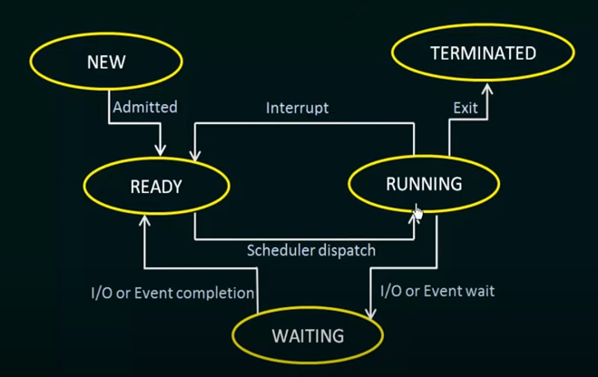

- **New**: the process is created
- **Ready**: waiting to be assigned to the processor
- **Running**: being executed
- **Waiting**: waiting for some events
- **Terminated**: finished execution

https://www.youtube.com/watch?v=jZ_6PXoaoxo&list=PLBlnK6fEyqRiVhbXDGLXDk_OQAeuVcp2O&index=17
